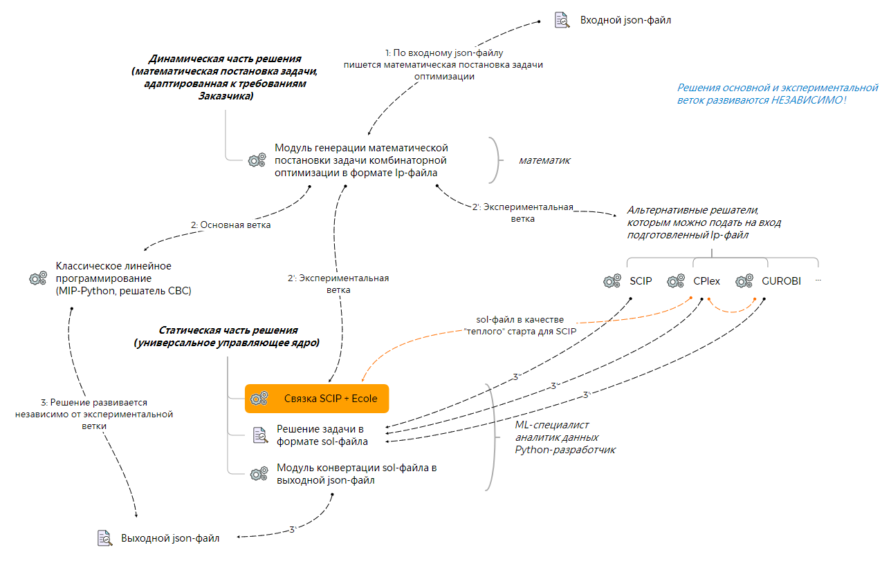
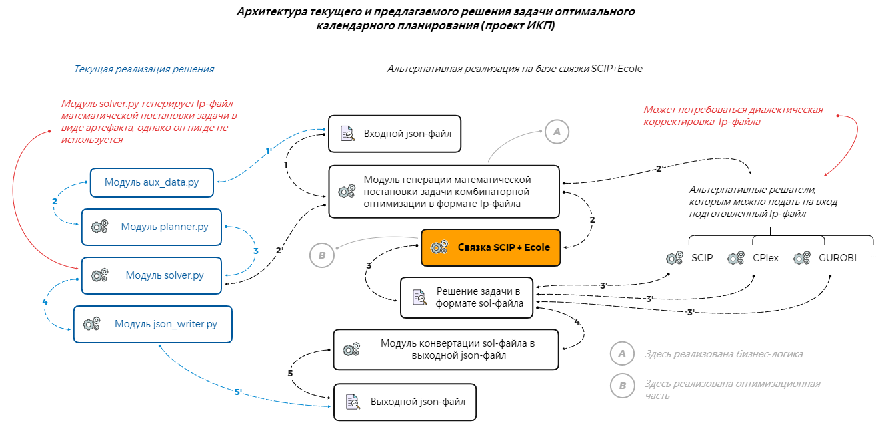

### Замечание
Рекомендуется установить _утилиту управления git-публикациями_ [`pre-commit`](https://pre-commit.com)
```bash
# Установка
$ pip install pre-commit
$ pre-commit install
$ cat .git/hooks/pre-commit | sed -n "/gener.*/p"
# Порядок работы с утилитой
$ pre-commit --version
$ pre-commit run --color always --all-files
$ pre-commit run <hook_id>
$ pre-commit clean
$ pre-commit gc
```

### Основные сведения
Структура проекта
```bash
root
 \_ input_for_model/  # директория входных данных модели
     \_ ikp_milp_problem.lp
     \_ warm_start_for_SCIP.sol
     ...
 \_ output_from_model/  # директория выходных данных модели
     \_ IKP_MILP_SCIP_ECOLE_743414_0_168176_624143.sol
     \_ IKP_MILP_SCIP_ECOLE_743414_0_168176_624143.stats
 \_ settings_for_scip_solver/  # директория конфигураций решателя SCIP
     \_ scip_without_presolving.set
     \_ scip_without_presolving_and_heuristics.set
     ...
 \_ scip_ecole_model/  # директория основной логики работы связки SCIP+Ecole
     \_ documentation/
         \_ ...
     \_ envs.py  # модуль пользовательских реализаций окружений агента для Ecole
     \_ scip_ecole_logger.py  # логгер для SCIP+Ecole
 \_ run_scip_ecole_pipeline.py  # стартовый модуль связки SCIP+Ecole
 \_ scip_ecole_model_config.yaml  # конфигурационный файл управления связкой SCIP+Ecole
 \_ .env  # файл локальных переменных окружения
 \_ .flake8                  # --|
 \_ .isort.cfg               #   |- для утилиты pre-commit
 \_ .pre-commit-config.yaml  #   |
 \_ pyproject.toml           # --|
 \_ scip_ecole_log_config.ini  # конфигурация логгера
 \_ requirements.txt  # файл внешних зависимостей
 \_ README.md
 \_ run_main_pipeline.sh                     # --|- вспомогательные bash-сценарии
 \_ run_scip_with_settings_for_make_logs.sh  # --|
```
Настройка окружения
```bash
$ git clone https://github.com/.../SCIP_Ecole.git
$ cd SCIP_Ecole/
$ conda create --name scip_ecole python==3.8
$ conda activate scip_ecole
$ pip install -r requirements.txt
```
Управляющие параметры связки SCIP+Ecole, описаны в конфигурационном файле `scip_ecole_model_config.yaml`.

В скрытом файле `.env` указаны имена конфигурационных файлов, которые необходимо использовать прежде
чем будет прочитан основной конфигурационный файл `scip_ecole_model_config.yaml`.

Файлы `pyproject.toml`, `.isort.cfg`, `.flake8`, `.pre-commit-config.yaml` задают конфигурацию утилиты `pre-commit`.

В директории `input_for_model/` размещаются:
- lp/mps-файлы (файлы математической постановки задачи),
- sol-файлы (файлы стартового решения; их можно использовать для 'теплого' страта решателя SCIP).

В директории `output_from_model/` размещаются:
- sol-файлы решения оптимизационной задачи,
- stats-файлы, содержащие статистическую информацию хода решения.

В директории `settings_for_scip_solver/` расположены set-файлы различных вариантов предварительной настройки решателя SCIP.

Запуск решения
```bash
$ chmod +x run_main_pipeline.sh
-rwxr-xr-x@ 1  staff    45B 10 янв 02:30 run_main_pipeline.sh*
$ ./run_main_pipeline.sh
2022-01-10 02:35:37,909: INFO ->> Procedure for finding solution with `SCIP+Ecole` has been started ...
2022-01-10 02:35:37,914: INFO ->> File `scip_ecole_model_config.yaml` has been read successfully!
2022-01-10 02:35:37,915: INFO ->> File `settings_for_scip_solver/scip_test.set` has been read successfully!
original problem has 743414 variables (0 bin, 168176 int, 0 impl, 575238 cont) and 624143 constraints
...
  558s|     1 |     0 |120604 |     - |  3706M |   0 | 330k| 200k| 201k|1486 |  9 |   0 |   0 | 3.740507e+10 | 1.221046e+11 | 226.44%| unknown
  581s|     1 |     0 |123114 |     - |  3730M |   0 | 330k| 200k| 201k|1789 | 10 |   0 |   0 | 3.740556e+10 | 1.221046e+11 | 226.43%| unknown
  604s|     1 |     0 |124247 |     - |  3750M |   0 | 330k| 200k| 201k|1919 | 11 |   0 |   0 | 3.740815e+10 | 1.221046e+11 | 226.41%| unknown
r 796s|     1 |     0 |176492 |     - |intshift|   0 | 330k| 200k| 201k|1919 | 11 |   0 |   0 | 3.740815e+10 | 4.076301e+10 |   8.97%| unknown
...
SCIP Status        : solving was interrupted [time limit reached]
Solving Time (sec) : 1203.02
Solving Nodes      : 1
Primal Bound       : +4.07630070052997e+10 (2 solutions)
Dual Bound         : +3.74081493450669e+10
Gap                : 8.97 %
2022-01-10 06:02:35,180: INFO ->>
	Summary:
	- Problem name (sense): IKP_MILP_SCIP_ECOLE (minimize)
	- N Vars: 743414
		* N Bin Vars: 0
		* N Int Vars: 168176
		* N Cont Vars: 575238
	- N Conss: 624143

	Results:
	- N Sols / N Best sols: 2 / 2
	- Objective value [timelimit]: 4.08e+10
	- Gap: 0.0897
	- Solving time: 20 min
```

Запуск решателя SCIP с заданными настройками и цепочкой действий
```bash
$ chmod +x run_scip_with_settings_for_make_logs.sh
$ ll run_scip_with_settings_for_make_logs.sh
-rwxr-xr-x  1 leor.finkelberg  staff   216B 10 янв 02:48 run_scip_with_settings_for_make_logs.sh*
$ cat run_scip_with_settings_for_make_logs.sh
#!/bin/bash
scip \
    -s settings_for_scip_solver/scip_without_presolving.set \
    -c "read input_for_model/ikp_milp_problem.lp optimize quit" \
    > output_from_model/scip_output_wo_presolving_and_separating.log
$ ./run_scip_with_settings_for_make_logs.sh
```
### Дополнительная информация

Архитектура продуктового решения на базе связки SCIP+Ecole



Общая архитектура решения на базе связки SCIP+Ecole



Реализация с внешним модулем машинного обучения


Процедурой поиска решения с помощью связки SCIP+Ecole можно управлять
через пользовательские классы модуля `envs.py`. После объявления класса останется только создать экземпляр окружения в модуле `run_scip_ecole_pipeline.py`
```bash
# Например
...
env = SimpleBranchingEnv(
    observation_function=ecole.observation.Pseudocosts(),
    reward_function=ecole.reward.SolvingTime(),
    information_function={
        "nb_nodes": ecole.reward.NNodes().cumsum(),
        "time": ecole.reward.SolvingTime().cumsum(),
    },
    scip_params=scip_params,
).create_env()
...
```
