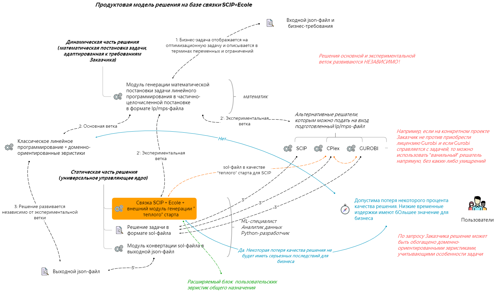
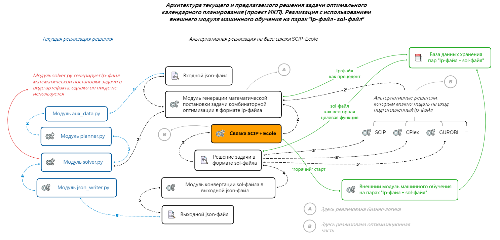

## _Гибкое динамическое ядро для решения задач линейного программирования в частично-целочисленной постановке на алгоритмической базе машинного и глубокого обучения_
### Замечание
Рекомендуется установить _утилиту управления git-публикациями_ [`pre-commit`](https://pre-commit.com)
```bash
# Установка
$ pip install pre-commit
$ pre-commit install
$ cat .git/hooks/pre-commit | sed -n "/gener.*/p"
# Порядок работы с утилитой
$ pre-commit --version
$ pre-commit run --color always --all-files
$ pre-commit run <hook_id>
$ pre-commit clean
$ pre-commit gc
$ git add .
$ git commit -v
[WARNING] Unstaged files detected.
[INFO] Stashing unstaged files to /Users/leor.finkelberg/.cache/pre-commit/patch1642131538-41980.
Fix End of Files.........................................................Passed
fix UTF-8 byte order marker..............................................Passed
Detect Private Key.......................................................Passed
Trim Trailing Whitespace.................................................Passed
Check docstring is first.............................(no files to check)Skipped
Check for merge conflicts................................................Passed
Check Yaml...........................................(no files to check)Skipped
Check Toml...........................................(no files to check)Skipped
Check JSON...........................................(no files to check)Skipped
isort................................................(no files to check)Skipped
black................................................(no files to check)Skipped
Strip unnecessary `# noqa`s..........................(no files to check)Skipped
pyupgrade............................................(no files to check)Skipped
check for not-real mock methods......................(no files to check)Skipped
type annotations not comments........................(no files to check)Skipped
```

### Основные сведения
Настройка окружения
```bash
$ git clone https://github.com/.../SCIP_Ecole.git
$ cd SCIP_Ecole/
$ conda create --name scip_ecole python==3.8
$ conda activate scip_ecole
$ pip install -r requirements.txt
```
Управляющие параметры связки SCIP+Ecole, описаны в конфигурационном файле `scip_ecole_model_config.yaml`.

В скрытом файле `.env` указаны имена конфигурационных файлов, которые необходимо использовать прежде
чем будет прочитан основной конфигурационный файл `scip_ecole_model_config.yaml`.

Файлы `pyproject.toml`, `.isort.cfg`, `.flake8`, `.pre-commit-config.yaml` задают конфигурацию утилиты `pre-commit`.

В директории `input_for_model/` размещаются:
- lp/mps-файлы (файлы математической постановки задачи),
- sol-файлы (файлы стартового решения; их можно использовать для 'теплого' страта решателя SCIP).

В директории `output_from_model/` размещаются:
- sol-файлы решения оптимизационной задачи,
- stats-файлы, содержащие статистическую информацию хода решения.

В директории `settings_for_scip_solver/` расположены set-файлы различных вариантов предварительной настройки решателя SCIP.

Запуск решения
```bash
$ chmod +x run_main_pipeline.sh
-rwxr-xr-x@ 1  staff    45B 10 янв 02:30 run_main_pipeline.sh*
$ ./run_main_pipeline.sh
2022-01-14 06:37:08,069: INFO ->> Procedure for finding solution with `SCIP+Ecole` has been started ...
2022-01-14 06:37:08,073: INFO ->> File `scip_ecole_model_config.yaml` has been read successfully!
2022-01-14 06:37:08,073: INFO ->> File `settings_for_scip_solver/scip_base.set` has been read successfully!
2022-01-14 06:37:13,215: INFO ->> File `planner_from_scip_50197df7.lp` has been read successfully!
2022-01-14 06:37:13,868: INFO ->> File `warm_start_for_SCIP_50197df7.sol` has been read successfully!

1/1 feasible solution given by solution candidate storage, new primal bound 6.611593e+10

presolving:
(round 1, fast)       242183 del vars, 265667 del conss, 6 add conss, 571547 chg bounds, 5465 chg sides, 40 chg coeffs, 0 upgd conss, 0 impls, 59 clqs
(round 2, fast)       369927 del vars, 338399 del conss, 861 add conss, 841470 chg bounds, 7931 chg sides, 195 chg coeffs, 0 upgd conss, 3 impls, 503 clqs
(round 3, fast)       385834 del vars, 391108 del conss, 1184 add conss, 857970 chg bounds, 8871 chg sides, 1771 chg coeffs, 0 upgd conss, 27 impls, 502 clqs
(round 4, fast)       425516 del vars, 394440 del conss, 1200 add conss, 860977 chg bounds, 8945 chg sides, 1771 chg coeffs, 0 upgd conss, 27 impls, 498 clqs
(round 5, fast)       427865 del vars, 395247 del conss, 1200 add conss, 861808 chg bounds, 8959 chg sides, 1771 chg coeffs, 0 upgd conss, 27 impls, 498 clqs
(round 6, fast)       428627 del vars, 395668 del conss, 1200 add conss, 862224 chg bounds, 8980 chg sides, 1771 chg coeffs, 0 upgd conss, 27 impls, 498 clqs
(round 7, fast)       429068 del vars, 396057 del conss, 1200 add conss, 862603 chg bounds, 8993 chg sides, 1771 chg coeffs, 0 upgd conss, 27 impls, 498 clqs
(round 8, fast)       429451 del vars, 396379 del conss, 1200 add conss, 862873 chg bounds, 8997 chg sides, 1771 chg coeffs, 0 upgd conss, 27 impls, 498 clqs
(round 9, fast)       429802 del vars, 396681 del conss, 1200 add conss, 863080 chg bounds, 9002 chg sides, 1771 chg coeffs, 0 upgd conss, 27 impls, 498 clqs
(round 10, fast)       430081 del vars, 396936 del conss, 1200 add conss, 863226 chg bounds, 9010 chg sides, 1771 chg coeffs, 0 upgd conss, 27 impls, 498 clqs
(round 11, fast)       430304 del vars, 397146 del conss, 1200 add conss, 863313 chg bounds, 9013 chg sides, 1771 chg coeffs, 0 upgd conss, 27 impls, 498 clqs
   (8.0s) running MILP presolver
   (11.4s) MILP presolver (27 rounds): 63469 aggregations, 1302 fixings, 90418 bound changes
(round 12, medium)     495239 del vars, 397308 del conss, 1200 add conss, 953767 chg bounds, 9016 chg sides, 1771 chg coeffs, 0 upgd conss, 27 impls, 498 clqs
(round 13, fast)       495248 del vars, 462224 del conss, 1363 add conss, 953792 chg bounds, 17884 chg sides, 1826 chg coeffs, 0 upgd conss, 27 impls, 520 clqs
(round 14, exhaustive) 495306 del vars, 467502 del conss, 1363 add conss, 955287 chg bounds, 17904 chg sides, 1826 chg coeffs, 0 upgd conss, 27 impls, 520 clqs
(round 15, fast)       495893 del vars, 468091 del conss, 1419 add conss, 955287 chg bounds, 17906 chg sides, 1828 chg coeffs, 0 upgd conss, 27 impls, 520 clqs
(round 16, exhaustive) 495895 del vars, 468113 del conss, 1419 add conss, 955290 chg bounds, 17951 chg sides, 1828 chg coeffs, 18590 upgd conss, 27 impls, 520 clqs
   (14.8s) sparsify finished: 4/777097 (0.0%) nonzeros canceled - in total 4 canceled nonzeros, 4 changed coefficients, 0 added nonzeros
   (15.2s) probing: 51/6139 (0.8%) - 0 fixings, 0 aggregations, 0 implications, 0 bound changes
   (15.2s) probing aborted: 50/50 successive totally useless probings
   (15.7s) symmetry computation started: requiring (bin +, int -, cont +), (fixed: bin -, int +, cont -)
   (17.6s) symmetry computation finished: 289 generators found (max: 289, log10 of symmetry group size: 184.0)
presolving (17 rounds: 17 fast, 4 medium, 3 exhaustive):
 497950 deleted vars, 469531 deleted constraints, 1455 added constraints, 955290 tightened bounds, 0 added holes, 17951 changed sides, 9242 changed coefficients
 1039 implications, 519 cliques
presolved problem has 218943 variables (6109 bin, 89683 int, 54 impl, 123097 cont) and 135339 constraints
  18415 constraints of type <varbound>
      1 constraints of type <knapsack>
     64 constraints of type <setppc>
 116823 constraints of type <linear>
     36 constraints of type <orbitope>
Presolving Time: 16.04

 time | node  | left  |LP iter|LP it/n|mem/heur|mdpt |vars |cons |rows |cuts |sepa|confs|strbr|  dualbound   | primalbound  |  gap   | compl.
 76.2s|     1 |     0 | 82131 |     - |  2788M |   0 | 218k| 132k| 132k|   0 |  0 |   0 |   0 | 3.529719e+10 | 6.611593e+10 |  87.31%| unknown
  181s|     1 |     0 | 83325 |     - |  2827M |   0 | 218k| 132k| 132k| 105 |  1 |   0 |   0 | 3.529763e+10 | 6.611593e+10 |  87.31%| unknown
  194s|     1 |     0 | 83339 |     - |  2853M |   0 | 218k| 132k| 132k| 111 |  2 |   0 |   0 | 3.529763e+10 | 6.611593e+10 |  87.31%| unknown
  209s|     1 |     0 | 86181 |     - |  2871M |   0 | 218k| 132k| 132k| 411 |  3 |   0 |   0 | 3.529764e+10 | 6.611593e+10 |  87.31%| unknown
  226s|     1 |     0 | 88886 |     - |  2891M |   0 | 218k| 132k| 132k| 566 |  4 |   0 |   0 | 3.529771e+10 | 6.611593e+10 |  87.31%| unknown
  246s|     1 |     0 | 93043 |     - |  2916M |   0 | 218k| 132k| 133k| 879 |  5 |   0 |   0 | 3.529780e+10 | 6.611593e+10 |  87.31%| unknown
  333s|     1 |     0 |104676 |     - |  2931M |   0 | 218k| 132k| 133k|1125 |  6 |   0 |   0 | 3.529803e+10 | 6.611593e+10 |  87.31%| unknown
  439s|     1 |     0 |105972 |     - |  2950M |   0 | 218k| 132k| 133k|1362 |  7 |   0 |   0 | 3.529807e+10 | 6.611593e+10 |  87.31%| unknown
  453s|     1 |     0 |107095 |     - |  2968M |   0 | 218k| 132k| 133k|1544 |  8 |   0 |   0 | 3.529807e+10 | 6.611593e+10 |  87.31%| unknown
  468s|     1 |     0 |108578 |     - |  2985M |   0 | 218k| 132k| 134k|1830 |  9 |   0 |   0 | 3.529897e+10 | 6.611593e+10 |  87.30%| unknown
  484s|     1 |     0 |110582 |     - |  3008M |   0 | 218k| 132k| 134k|2086 | 10 |   0 |   0 | 3.529899e+10 | 6.611593e+10 |  87.30%| unknown
  498s|     1 |     0 |111602 |     - |  3023M |   0 | 218k| 132k| 133k|2163 | 11 |   0 |   0 | 3.529976e+10 | 6.611593e+10 |  87.30%| unknown
r 567s|     1 |     0 |140667 |     - |intshift|   0 | 218k| 132k| 133k|2163 | 11 |   0 |   0 | 3.529976e+10 | 3.905384e+10 |  10.63%| unknown

SCIP Status        : solving was interrupted [time limit reached]
Solving Time (sec) : 701.40
Solving Nodes      : 1
Primal Bound       : +3.90538416983005e+10 (2 solutions)
Dual Bound         : +3.52997553280834e+10
Gap                : 10.63 %
2022-01-14 05:01:40,153: INFO ->>
	Summary:
	- Problem name (sense): IKP_MILP_SCIP_ECOLE (minimize)
	- N Vars: 716891
		* N Bin Vars: 0
		* N Int Vars: 159402
		* N Cont Vars: 557489
	- N Conss: 603389

	Results:
	- N Sols / N Best sols: 2 / 2
	- Objective value [timelimit]: 3.9053842e+10
	- Gap: 10.6%
	- Solving time: 12 min
```

Запуск генератора "теплого" старта
```bash
$ python warm_start_generator.py \
    --path-to-lp-file ./input_for_model/planner_bin_from_scip_50197df7.lp \
    --path-to-sol-file ./input_for_model/warm_start_for_SCIP_bin_50197df7.sol
$ ll input_for_model/
    ... planner_bin_from_scip_50197df7_wo_zeros_vals.lp
```

Запуск решателя SCIP с заданными настройками и цепочкой действий
```bash
$ chmod +x run_scip_with_settings_for_make_logs.sh
$ ll run_scip_with_settings_for_make_logs.sh
-rwxr-xr-x  1 leor.finkelberg  staff   216B 10 янв 02:48 run_scip_with_settings_for_make_logs.sh*
$ cat run_scip_with_settings_for_make_logs.sh
#!/bin/bash
scip \
    -s settings_for_scip_solver/scip_without_presolving.set \
    -c "read input_for_model/ikp_milp_problem.lp optimize quit" \
    > output_from_model/scip_output_wo_presolving_and_separating.log
$ ./run_scip_with_settings_for_make_logs.sh
```

Сборка решателя SCIP в многопоточном режиме (флаг [`TPI=tny`](https://scipopt.org/doc-7.0.1/html/MAKE.php)) и настройка решателя SCIP.
Перед установкой SCIP на Linux следует установить `boost`, `gmp` etc. (http://listserv.zib.de/pipermail/scip/2020-November/004144.html)
Замечание. Пакет `libc++` полностью поддерживается только в MacOS. Linux использует `libstdc++` и поэтому нужно устанавливать GCC весрии 5.1.*
```bash
# MacOS
$ make \
    ZLIB=false \
    READLINE=false \
    ZIMPL=false \
    LPS=spx2 # new SoPlex LP-solver (default) (from version 2)
    TPI=tny # use the tinycthread's library which is bundled with SCIP
$ scip
SCIP> read planner.lp
SCIP> read warm_start.sol
SCIP> set paral minnthreads 4
SCIP> set paral maxnthreads 8
# Linux
$ sudo yum install -y epel-release
$ sudo yum install gcc-c++
$ gcc --version # gcc (GCC) 4.8.5 ...
$ sudo yum install centos-release-scl
$ sudo yum install devtoolset-7
$ scl enable devtoolset-7 bash
$ gcc --version # gcc (GCC) 7.3.1 ...
$ sudo yum install boost boost-devel # будут установлены boost-thread, boost-system etc.
$ sudo yum install gmp-devel
$ sudo yum install cppzmq-devel
$ curl -o ./scipoptsuite-7.0.3.tgz https://scipopt.org/download.php\?fname\=scipoptsuite-7.0.3.tgz
$ tar xvf scipoptsuite-7.0.3.tgz
$ cd scipoptsuite-7.0.3
$ make \
    ZLIB=false \
    READLINE=false \
    ZIMPL=false \
    LPS=spx2 # new SoPlex LP-solver (default) (from version 2)
    TPI=tny # use the tinycthread's library which is bundled with SCIP
$ scip
SCIP> read planner.lp
SCIP> read warm_start.sol
SCIP> set paral minnthreads 4
SCIP> set paral maxnthreads 8
```
### Дополнительная информация

Архитектура продуктового решения на базе связки SCIP+Ecole



Общая архитектура решения на базе связки SCIP+Ecole


Реализация с внешним модулем машинного обучения



Процедурой поиска решения с помощью связки SCIP+Ecole можно управлять
через пользовательские классы модуля `envs.py`. После объявления класса останется только создать экземпляр окружения в модуле `run_scip_ecole_pipeline.py`
```bash
# Например
...
env = SimpleBranchingEnv(
    observation_function=ecole.observation.Pseudocosts(),
    reward_function=ecole.reward.SolvingTime(),
    information_function={
        "nb_nodes": ecole.reward.NNodes().cumsum(),
        "time": ecole.reward.SolvingTime().cumsum(),
    },
    scip_params=scip_params,
).create_env()
...
```
